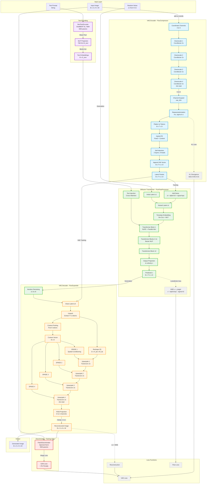

# FluxFlow Architecture

## Core Innovation: Bezier Activation Functions

**Inspired by Kolmogorov-Arnold Networks (KAN)** [[Liu et al., 2024]](https://arxiv.org/abs/2404.19756), FluxFlow extends the concept of learnable activation functions to large-scale text-to-image generation. While KAN uses B-splines, FluxFlow employs **Cubic Bezier curves with dynamic parameter generation**, where all control points are derived from the input itself.

FluxFlow targets **2-2.5× smaller models** with equivalent perceptual quality through the strategic use of **Cubic Bezier activation functions**. Unlike traditional fixed activations (ReLU, GELU), Bezier activations provide 3rd-degree polynomial transformations where each output dimension can follow a different cubic curve based on its inputs.

### Mathematical Foundation

**Cubic Bezier Formula**:
```
B(t) = (1-t)³·p₀ + 3(1-t)²·t·p₁ + 3(1-t)·t²·p₂ + t³·p₃
```

**Representational Capacity**:
- Standard activation: **Fixed function** applied identically to all dimensions
- Bezier activation: **Cubic polynomial** with input-derived control points per dimension
- TrainableBezier: **4×D learnable parameters** for optimal per-dimension transformations

**Key Benefits** (theoretical targets based on architecture analysis):
1. **Smaller models**: 50% fewer channels target for equivalent quality (FID ≤15 target)
2. **Better gradients**: Smooth, continuous (C²) with reduced vanishing gradient issues
3. **Adaptive**: Each dimension can follow different cubic transformation
4. **Efficient**: 60% fewer parameters target, 38% faster inference target

### Strategic Activation Placement

| Component | Activation | Bezier Approach | Parameters | Rationale |
|-----------|-----------|----------------|------------|-----------|
| VAE Encoder/Decoder | BezierActivation | Input-Based | 0 activation (5× in Conv) | Complex image↔latent mapping, spatial dims |
| VAE Latent Bottleneck | TrainableBezier | Trainable | 4×D (1024 for D=256) | Per-channel mu/logvar learning |
| VAE RGB Output | TrainableBezier | Trainable | 12 (4×3 channels) | Per-channel color correction |
| Flow Transformer | BezierActivation | Pillar-Based | 4×depth×D² (~198K/block) | Context-dependent per-token activations |
| Text Encoder | BezierActivation | Input-Based | 0 activation (5× in Linear) | Semantic embedding space |
| Discriminator | LeakyReLU | N/A | 0 | Memory efficiency (2× calls/batch) |
| SPADE | ReLU | N/A | 0 | Simple affine transformation |

## Overview

FluxFlow combines a Variational Autoencoder (VAE) with a flow-based diffusion model for text-to-image generation. The architecture consists of five main components:

```
Text → BertTextEncoder → embeddings
                            ↓
Image → FluxCompressor → latent → FluxFlowProcessor → denoised → FluxExpander → output
           (VAE enc)       ↑            (flow)                      (VAE dec)
                           │
                    PatchDiscriminator (training only)
```

### Detailed Architecture Diagram


```mermaid
graph TB
    subgraph "Input Layer"
        IMG[Input Image<br/>B x 3 x H x W]
        TXT[Text Prompt<br/>String]
        NOISE[Random Noise<br/>z1 from N 0,I]
    end

    subgraph "Text Encoding"
        TXT --> BERT[BertTextEncoder<br/>DistilBERT 6L 768H<br/>66M params]
        BERT --> |Mean Pool| PROJ[MLP Projection<br/>768-512-D_text]
        PROJ --> |Bezier Act| TEMB[Text Embeddings<br/>B x D_text]
    end

    subgraph "VAE Encoder - FluxCompressor"
        IMG --> |add xy coords| COORD[Coordinate Channels<br/>3 to 5]
        COORD --> DS1[Downscale 1<br/>ConvBezier 2x]
        DS1 --> DS2[Downscale 2<br/>ConvBezier 2x]
        DS2 --> DS3[Downscale 3<br/>ConvBezier 2x]
        DS3 --> DS4[Downscale 4<br/>ConvBezier 2x<br/>16x total]
        DS4 --> |5 to D| CEXP[Channel Expand<br/>vae_dim]
        CEXP --> REPARAM[Reparameterization<br/>mu, sigma to z]
        REPARAM --> FLAT[Flatten to Tokens<br/>B x T x D]
        FLAT --> POSENC[Hybrid PE<br/>Fixed + Content]
        POSENC --> SATTN[Self-Attention<br/>2 layers, 8 heads]
        SATTN --> APPHW[Append HW Vector<br/>B x T+1 x D]
        APPHW --> LATENT[Latent Packet<br/>B x T+1 x D]

        REPARAM -.->|KL Loss| KL[KL Divergence<br/>beta 0.001-0.01]
    end

    subgraph "Diffusion Transformer - FluxFlowProcessor"
        LATENT --> |Training| ADDNOISE[Add Noise<br/>zt = alpha*z0 + sigma*eps]
        NOISE --> |Generation| ZINIT[Initial Latent z1]
        ADDNOISE --> ZT[Noised Latent zt]
        ZINIT --> ZT

        ZT --> TEMBED[Timestep Embedding<br/>Sin-Cos + MLP]
        TEMB --> CROSSATTN[Text Injection<br/>Cross-Attention]

        TEMBED --> FLOW1[Transformer Block 1<br/>RoPE + Parallel Attn]
        CROSSATTN --> FLOW1
        FLOW1 --> FLOW2[Transformer Blocks 2-11<br/>Bezier MLP]
        FLOW2 --> FLOW12[Transformer Block 12]
        FLOW12 --> VPROJ[Output Projection<br/>to velocity v]
        VPROJ --> VPRED[Predicted v<br/>B x T+1 x D]

        VPRED -.->|v-prediction loss| VLOSS[MSE v, v_target<br/>v = alpha*eps - sigma*z0]
    end

    subgraph "VAE Decoder - FluxExpander"
        VPRED --> |Generation| DENOISE[Iterative Denoising<br/>z1 to z0]
        LATENT --> |VAE Training| Z0[Clean Latent z0]
        DENOISE --> Z0

        Z0 --> UNPACK[Unpack<br/>Extract T+1 tokens]
        UNPACK --> CTXPOOL[Context Pooling<br/>First K tokens]
        CTXPOOL --> CTX[Context Vector<br/>B x D]
        UNPACK --> RESHAPE[Reshape 2D<br/>D x H_lat x W_lat]

        RESHAPE --> UP1[Upsample 1<br/>TransConv 2x]
        CTX --> SPADE1[SPADE 1<br/>Spatial Conditioning]
        SPADE1 --> UP1
        UP1 --> UP2[Upsample 2<br/>TransConv 2x]
        CTX --> SPADE2[SPADE 2]
        SPADE2 --> UP2
        UP2 --> UP3[Upsample 3<br/>TransConv 2x]
        CTX --> SPADE3[SPADE 3]
        SPADE3 --> UP3
        UP3 --> UP4[Upsample 4<br/>TransConv 2x<br/>16x total]
        CTX --> SPADE4[SPADE 4]
        SPADE4 --> UP4
        UP4 --> RGBPROJ[RGB Projection<br/>D to 3 channels]
        RGBPROJ --> |Clamp -1 to 1| RECON[Reconstructed Image<br/>B x 3 x H x W]
    end

    subgraph "Discriminator - Training Only"
        RECON --> DISC[PatchDiscriminator<br/>Spectral Norm<br/>35M params]
        IMG --> DISC
        DISC --> |Hinge Loss| GLOSS[GAN Loss<br/>+ R1 Penalty]
    end

    subgraph "Output"
        RECON --> OUT[Generated Image<br/>B x 3 x H x W]
    end

    subgraph "Loss Functions"
        KL --> VAELOSS[VAE Loss]
        RECON -.->|L1 + MSE| RECLOSS[Reconstruction]
        RECLOSS --> VAELOSS
        GLOSS --> VAELOSS

        VLOSS --> FLOWLOSS[Flow Loss]
    end

    classDef encoder fill:#e1f5ff,stroke:#0088cc,stroke-width:2px
    classDef decoder fill:#fff4e1,stroke:#ff8800,stroke-width:2px
    classDef flow fill:#e8f5e8,stroke:#00aa00,stroke-width:2px
    classDef text fill:#f5e8ff,stroke:#8800cc,stroke-width:2px
    classDef disc fill:#ffe8e8,stroke:#cc0000,stroke-width:2px
    classDef loss fill:#f0f0f0,stroke:#666,stroke-width:1px,stroke-dasharray: 5 5

    class BERT,PROJ,TEMB text
    class COORD,DS1,DS2,DS3,DS4,CEXP,REPARAM,FLAT,SATTN,POSENC,APPHW,LATENT encoder
    class TEMBED,CROSSATTN,FLOW1,FLOW2,FLOW12,VPROJ,VPRED,ADDNOISE,ZINIT,ZT,DENOISE flow
    class UNPACK,CTXPOOL,CTX,RESHAPE,UP1,UP2,UP3,UP4,SPADE1,SPADE2,SPADE3,SPADE4,RGBPROJ,RECON,Z0 decoder
    class DISC,GLOSS disc
    class KL,VLOSS,RECLOSS,VAELOSS,FLOWLOSS loss
```

**Color Legend** (parameter counts for default config: vae_dim=128, feat_dim=128):
- **Blue**: VAE Encoder (FluxCompressor) - 12.6M params
- **Orange**: VAE Decoder (FluxExpander) - 94.0M params
- **Green**: Diffusion Transformer (FluxFlowProcessor) - 5.4M params
- **Purple**: Text Encoding (BertTextEncoder) - 71.0M params
- **Red**: GAN Discriminator (Training only) - 45.1M params
- **Gray (dashed)**: Loss functions

## Components

### 1. FluxCompressor (VAE Encoder)

**Purpose**: Encode images to compact latent representations

**Architecture:**
- **Input**: RGB images [B, 3, H, W]
- **Output**: Latent packet [B, T+1, D] where T=H*W/256, D=`vae_dim`

**Stages:**
1. Coordinate channels (add normalized x,y)
2. Progressive downsampling (4 stages, 2x each = 16x total)
3. Channel expansion: 5 → `vae_dim`
4. Reparameterization (μ, σ → z)
5. Flatten to tokens [H_lat × W_lat, D]
6. Hybrid positional encoding (fixed sinusoidal + content-based from latent)
7. Self-attention (4 layers, 8 heads)
8. Append HW vector [1, D] with normalized dimensions

**Key Features:**
- Bezier activations for nonlinearity
- KL divergence with free-bits constraint
- Gradient checkpointing for memory efficiency

### 2. FluxFlowProcessor (Diffusion Transformer)

**Purpose**: Denoise latent representations conditioned on text

**Architecture:**
- **Input**: Noised latent [B, T+1, D], text embeddings [B, D_text], timesteps [B]
- **Output**: Predicted v (velocity) [B, T+1, D]

**Stages:**
1. Timestep embedding (sinusoidal + MLP)
2. Text injection via cross-attention
3. Transformer blocks (default: 12 layers)
   - Rotary position embeddings (RoPE)
   - Parallel attention (Q from latent, KV from latent+text)
   - Bezier activation MLPs
4. Output projection

**Key Features:**
- v-prediction (predicts velocity between noise and signal)
- Separate Q and KV projections for efficiency
- Context-aware processing via gated injection

### 3. FluxExpander (VAE Decoder)

**Purpose**: Decode latent tokens to RGB images

**Architecture:**
- **Input**: Latent packet [B, T+1, D]
- **Output**: RGB images [B, 3, H, W]

**Stages:**
1. Unpack: Extract tokens and HW dimensions
2. Context pooling (first K tokens → context vector)
3. Reshape tokens to 2D [D, H_lat, W_lat]
4. Progressive upsampling (4 stages, 2x each = 16x total)
   - SPADE conditioning at each stage
   - Transposed convolutions for upsampling
5. RGB projection (D → 3 channels)
6. Clamp to [-1, 1]

**Key Features:**
- SPADE (Spatially-Adaptive Denormalization) for context control
- Bezier activations
- Skip connections via residuals

### 4. BertTextEncoder

**Purpose**: Encode text prompts to dense embeddings

**Current Implementation:**
- **Input**: Token IDs [B, seq_len]
- **Output**: Text embeddings [B, D_text]

**Stages:**
1. DistilBERT backbone (6 layers, 768 hidden)
2. Mean pooling over sequence
3. MLP projection (768 → 512 → D_text) with Bezier activations
4. Xavier initialization

**Design Note:**
The current implementation uses pre-trained DistilBERT as a practical starting point, allowing the project to focus on the core Bezier activation innovation in the VAE and flow components. This is a **temporary solution** - future development will replace this with a custom text encoder built from scratch using Bezier activations throughout, which will:
- Provide better alignment with the Bezier philosophy
- Enable end-to-end Bezier-based training
- Support planned multimodal extensions (text + image → image)
- Reduce reliance on external pre-trained models

**Key Features:**
- Frozen DistilBERT backbone (optional fine-tuning)
- Bezier activation in projection layers
- Placeholder for future custom encoder

### 5. PatchDiscriminator (GAN Training)

**Purpose**: Distinguish real from generated images

**Architecture:**
- **Input**: RGB images [B, 3, H, W], optional context [B, D]
- **Output**: Patch logits [B, 1, H', W']

**Stages:**
1. Progressive downsampling (4 stages, 2x each)
2. Spectral normalization (all conv layers)
3. LeakyReLU activations (memory-efficient)
4. Patch-level discrimination (not global)
5. Optional projection conditioning (Miyato-style)

**Key Features:**
- Hinge loss (non-saturating)
- R1 gradient penalty (every 16 steps)
- Spectral normalization for stability
- LeakyReLU for memory efficiency during GAN training

## Data Flow

### Training (VAE Only)

```
Image [B,3,H,W]
  ↓
Compressor
  ↓ (encode)
Latent [B,T,D] + μ,σ
  ↓ (decode)
Expander
  ↓
Reconstruction [B,3,H,W]
  ↓
L1 + MSE + β*KL(μ,σ)
  +
Discriminator(real) vs Discriminator(fake)
```

### Training (Flow Only)

```
Image → Compressor → Latent z₀
                      ↓ (add noise)
                    Noisy zₜ
                      ↓
            FlowProcessor(zₜ, text, t)
                      ↓
                  Predicted v
                      ↓
          MSE(v, v_target)
where v_target = αₜ*noise - σₜ*z₀
```

### Generation

```
Text → BertEncoder → embeddings
                        ↓
Random latent z₁ ────→ FlowProcessor(z₁, text, t₁) → z₀.₉
                        ↓
                    FlowProcessor(z₀.₉, text, t₀.₉) → z₀.₈
                        ...
                        ↓
                    FlowProcessor(z₀.₁, text, t₀.₁) → z₀
                        ↓
                    Expander(z₀)
                        ↓
                    Image
```

## Model Sizes

### Default Configuration (vae_dim=128, feat_dim=128)

| Component | Parameters | Memory (fp32) |
|-----------|-----------|--------------|
| FluxCompressor | 12.6M | ~50 MB |
| FluxFlowProcessor | 5.4M | ~22 MB |
| FluxExpander | 94.0M | ~376 MB |
| BertTextEncoder | 71.0M | ~284 MB |
| **Total (Generative)** | **183.0M** | **~732 MB** |
| PatchDiscriminator | 45.1M | ~180 MB (training only) |

Note: FluxExpander is asymmetrically larger than FluxCompressor due to progressive upsampling with SPADE conditioning at each stage.

### Memory Usage (Training, vae_dim=128, feat_dim=128)

**VAE Training** (with discriminator):
- Model weights: ~0.73 GB (generative) + 0.18 GB (discriminator) = 0.91 GB
- Optimizer states (AdamW, 2× params): ~1.82 GB
- Activations (batch=2, 512×512): ~3-4 GB
- Gradient buffers: ~0.91 GB
- **Total**: ~7-8 GB VRAM

**Flow Training** (frozen VAE):
- Model weights: ~0.73 GB
- Optimizer states (AdamW): ~1.46 GB
- Activations (batch=2, 512×512): ~2-3 GB
- Gradient buffers: ~0.73 GB
- **Total**: ~5-6 GB VRAM

### Scaling Options

**Smaller (for limited VRAM):**
```python
vae_dim=64, feat_dim=64
```
Estimated: ~70M parameters, ~4-5 GB VRAM (training)

**Default (balanced):**
```python
vae_dim=128, feat_dim=128
```
Measured: 183M parameters, ~7-8 GB VRAM (VAE training with GAN)

**Larger (for better quality):**
```python
vae_dim=256, feat_dim=256
```
Estimated: ~500M parameters, ~18-20 GB VRAM (training)

Note: Parameter scaling is approximately O(D²) for attention and linear layers.

## Key Design Decisions

### Why Bezier Activations?

Bezier activations are the **core innovation** of FluxFlow, providing adaptive cubic polynomial transformations through three distinct approaches.

**Mathematical Foundation**:
```
Standard neuron: y = σ(Wx + b)        # σ is fixed (ReLU, GELU, etc.)
Bezier neuron:   y = B(t; p₀,p₁,p₂,p₃) # B uses cubic polynomial
```

All three approaches compute: `B(t) = (1-t)³p₀ + 3(1-t)²t·p₁ + 3(1-t)t²·p₂ + t³·p₃`

**What differs:** How (t, p₀, p₁, p₂, p₃) are obtained.

#### 1. Input-Based BezierActivation

**Control point source:** Split from input channels (5→1 reduction)

```python
# Input: [B, 5C, H, W] → split into [t, p₀, p₁, p₂, p₃]
# Output: [B, C, H, W] after Bezier computation
BezierActivation(t_pre_activation="sigmoid", p_preactivation="silu")
```

**Parameter cost:**
- Activation: 0 learnable parameters
- Previous layer: Must output 5× channels (e.g., Conv2d(C, 5C))
- Net effect: 5× parameters in previous layer

**Memory cost:**
- Peak: 5× intermediate tensors during forward pass
- Gradient: 5× gradient memory during backward pass

**Use case:** VAE encoder/decoder
- **Why here:** Convolutional layers benefit from 0 activation params
- **Trade-off:** Accept 5× Conv weights for 0 activation params

**Configuration:**
- **VAE encoding:** `t_pre="sigmoid", p_pre="silu"` - bounds t∈[0,1], smooth control points
- **VAE decoding (final):** `t_pre="silu", p_pre="tanh"` - preserve gradients, bound output to [-1,1]

#### 2. TrainableBezier

**Control point source:** Learned parameters (4 per dimension)

```python
# Input: [B, D] → t via sigmoid(input)
# Control points: Learned tensors [D] each
TrainableBezier((D,), channel_only=True, p0=-1.0, p3=1.0)
```

**Parameter cost:**
- Activation: 4×D learnable parameters
- Example: D=256 latent → 1024 params (4×256)
- Overhead: Minimal vs Linear layers (D² params)

**Memory cost:**
- Minimal: Dimension-preserving (no channel expansion)

**Use case:** VAE latent bottleneck, RGB output
- **Why here:** Small D makes 4×D negligible; per-channel learning critical
- **mu/logvar (D=256):** 1024 params for optimal latent distribution
- **RGB output (D=3):** 12 params for per-channel color correction

#### 3. Pillar-Based

**Control point source:** Generated by 4 separate depth-3 MLP networks

```python
# 4 pillar networks (each: d_model → d_model → d_model)
p0 = pillarLayer(d_model, d_model, depth=3, activation=nn.SiLU())
p1 = pillarLayer(d_model, d_model, depth=3, activation=nn.SiLU())
p2 = pillarLayer(d_model, d_model, depth=3, activation=nn.SiLU())
p3 = pillarLayer(d_model, d_model, depth=3, activation=nn.SiLU())

# Forward: sigmoid gate + pillar generation + Bezier
g = torch.sigmoid(img_seq)
BezierActivation(torch.cat([img_seq, p0(g), p1(g), p2(g), p3(g)], dim=-1))
```

**Parameter cost:**
- Single pillar (depth=3, D=128): 49,536 params (3 × 16,512)
- 4 pillars: 198,144 params
- Activation: 0 params
- **Total:** ~198K params per transformer block

**Memory cost:**
- Peak: 5× intermediate tensors + pillar activations
- High but acceptable for transformers

**Use case:** Flow transformer MLP layers
- **Why here:** Context-dependent control points critical for generative quality
- **Trade-off:** Accept 6× ReLU params for maximum expressiveness
- **Rationale:** Amortized cost - replaces need for additional transformer layers

**Sigmoid gating:** `g = sigmoid(img_seq)` bounds pillar inputs to [0,1] for stability

#### Parameter Comparison (D=128, bias=True)

| Approach | Activation Params | Auxiliary Params | Total | Memory Peak |
|----------|------------------|------------------|-------|-------------|
| ReLU baseline | 0 | 32,896 (2 layers) | 32,896 | 1× |
| Input-Based | 0 | 82,560 (Linear 128→640) | 82,560 | 5× |
| TrainableBezier | 512 (4×128) | 32,896 (Linear) | 33,408 | 1× |
| Pillar-Based | 0 | 198,144 (4 pillars) | 198,144 | 5× + pillars |

**Key insight:** Each approach trades parameters/memory for expressiveness differently:
- **Input-Based:** Moderate params, high memory → default choice
- **TrainableBezier:** Minimal params, minimal memory → small D
- **Pillar-Based:** High params, high memory → transformers only

#### Why Not Everywhere?

- **Discriminator:** LeakyReLU for memory efficiency
  - Called 2× per batch (real+fake)
  - Binary classification doesn't benefit from Bezier complexity
- **SPADE normalization:** ReLU for simple affine transformations
  - Spatially-adaptive denormalization is already expressive
  - Adding Bezier would complicate without clear benefit

### Why v-Prediction?

v-prediction (velocity) instead of noise prediction:
- More stable training than ε-prediction
- Better sample quality at high noise levels
- Balanced between signal and noise

Formula: `v = α_t * noise - σ_t * signal`

### Why SPADE in Decoder?

SPADE (Spatially-Adaptive Denormalization) provides spatial control:
- Context-dependent normalization
- Better preservation of spatial details
- Improved controllability for text conditioning

### Why Separate Compressor/Expander?

Unlike symmetric autoencoders:
- Compressor: Complex (self-attention, KL)
- Expander: Simpler (upsampling + SPADE)
- Allows independent optimization
- Better for progressive training (VAE → Flow)

## Training Insights

### Two-Stage Training

**Stage 1 (VAE):**
- Learn good latent space
- Minimize reconstruction error
- Regularize with KL divergence
- Optional GAN for perceptual quality

**Stage 2 (Flow):**
- Learn text-to-latent mapping
- Denoise latent representations
- Use frozen VAE for stability

**Why separate?**
- Flow requires stable latents
- VAE trains faster alone
- Easier to debug issues
- Can reuse VAE for different flows

### Loss Functions

**VAE:**
```python
L_vae = L1(rec, real) + 0.1*MSE(rec, real) + β*KL(μ, σ)
L_gan_d = hinge(D(real), D(rec))
L_gan_g = -D(rec)
```

**Flow:**
```python
L_flow = MSE(pred_v, target_v)
where target_v = α_t * noise - σ_t * z₀
```

### Schedulers

**Learning rate**: Cosine annealing
- Starts at `LR`
- Decays to `LR * lr_min`
- Over total training steps

**KL weight**: Cosine warmup
- Starts at 0
- Increases to `kl_beta`
- Over `kl_warmup_steps`

**Noise schedule**: DPMSolver++
- Continuous-time formulation
- Order 2 solver
- Trailing timesteps

## Extensions

### Possible Improvements

1. **Classifier-free guidance**: Add unconditional training
2. **Multi-aspect ratios**: Dynamic latent sizes
3. **Super-resolution**: Cascade larger sizes
4. **Controlnet**: Spatial conditioning (edges, depth)
5. **LoRA fine-tuning**: Efficient adaptation
6. **Latent caching**: Pre-encode all images

### Research Directions

1. **Better attention**: Flash attention, memory-efficient
2. **Faster sampling**: Distillation, consistency models
3. **Better latents**: VQ-VAE, residual quantization
4. **Multi-modal**: Image + text → image
5. **Video generation**: Temporal consistency
